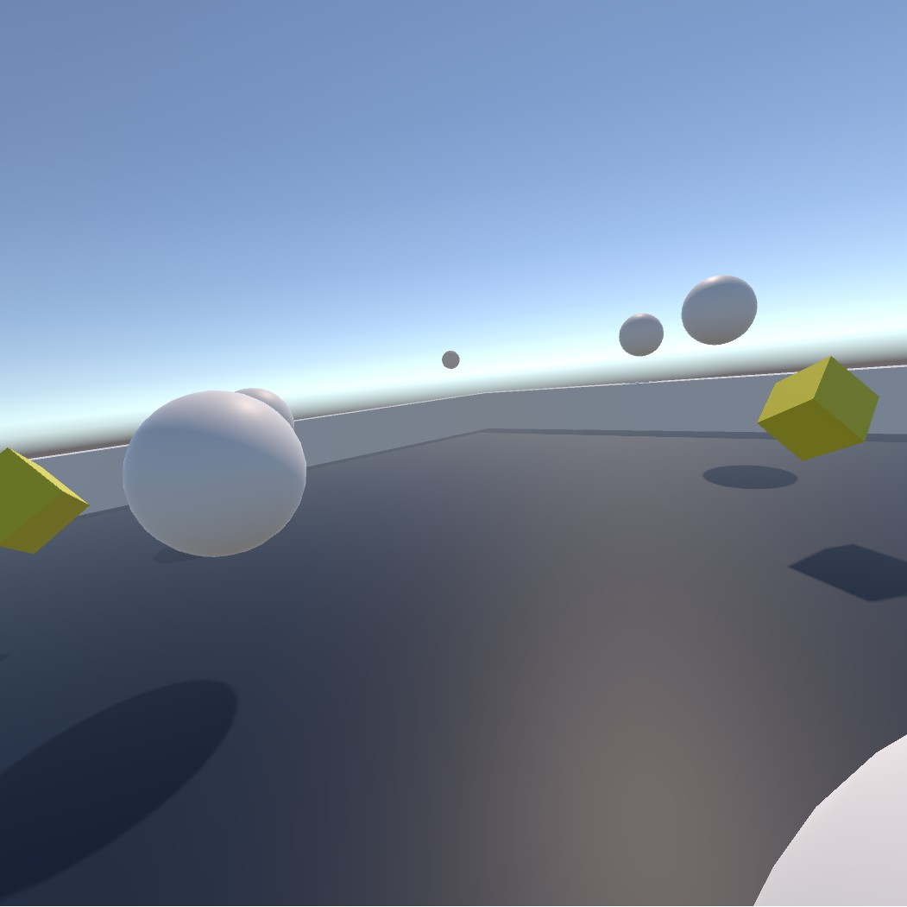

# Roll a Ball VR

Replaced the original [Roll a Ball Tutorial](https://unity3d.com/learn/tutorials/projects/roll-ball-tutorial)
controls with a barely modified SteamVR_TestThrow.cs and made the spheres bouncy. Far more interesting now.

* Unity 5.5
* HTC Vive

## Controls

Trigger to spawn a new huge ball on your hand. Throw it. It exists for 15 secs. Collect the cubes. That's it.

## License

* SteamVR Plugin: BSD-3-Clause License. Copyright (c) 2015, Valve Corporation.
* Zio Unity Theme: MIT License. Copyright (c) 2016 Zios.
* The rest: MIT License. Copyright (c) 2017 Brad Erickson.